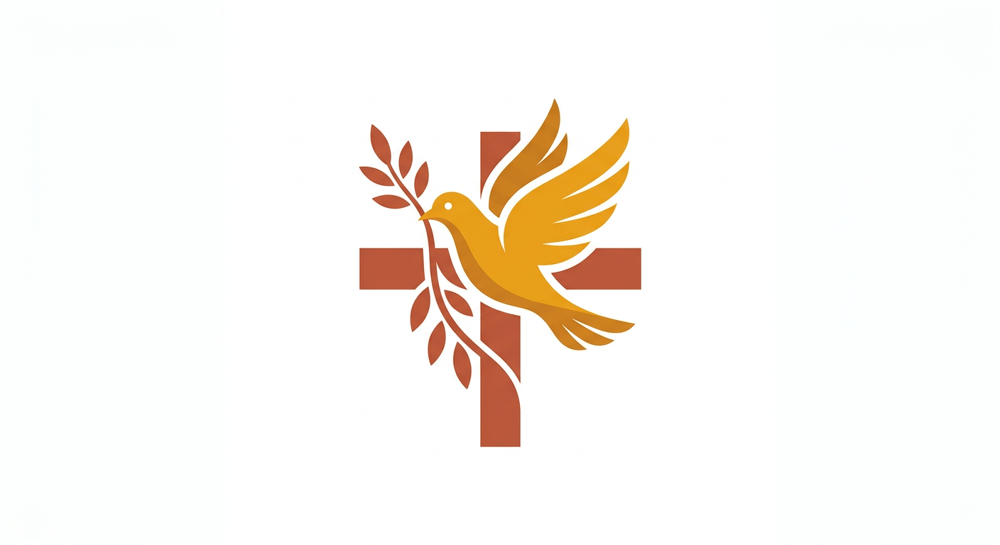

<p align="center">
  
</p>

<h1 align="center">굿뉴스 — 가톨릭 포털</h1>

<p align="center">
  <strong>catholic.or.kr 레거시 시스템을 현대적 스택으로 재구성한 가톨릭 종합 정보 포털</strong>
</p>

<p align="center">
  
  
  
  
  
</p>

<p align="center">
  
  
  
</p>

---

## Overview

Express + SQLite + jQuery로 구성된 catholic.or.kr 레거시 시뮬레이션을 **Next.js 15 App Router + Firebase Firestore + Tailwind CSS 4**로 전면 마이그레이션한 프로젝트입니다.

16개 SQLite 테이블 → Firestore 컬렉션, 20개 REST API → Firestore SDK 직접 접근으로 재구성하여 서버리스 아키텍처를 달성합니다.

<br/>

## Pages

| Route | Page | Description |
|-------|------|-------------|
| `/` | 메인 홈 | 배너 슬라이더, 뉴스 티커, 퀵링크, 오늘의 가톨릭, 게시판 미리보기 |
| `/mass` | 매일미사 | 날짜별 전례 독서 (제1독서, 화답송, 복음 등) |
| `/bible` | 성경 | 공동번역 6권 6,511절 풀텍스트 (창세기~여호수아) |
| `/saints` | 성인 | 축일별 가톨릭 성인 25위 |
| `/hymns` | 성가 | 카테고리별 성가 35곡 검색 |
| `/prayers` | 기도문 | 기본기도, 묵주기도, 생활기도 15편 아코디언 |
| `/board` | 게시판 | 묵상나눔 / 자유게시판 / 질문답변 55개 게시물 |
| `/gallery` | 갤러리 | 전례꽃꽂이, 성화, 성당건축, 성지 12점 |
| `/login` | 로그인 | Firebase Auth (Google Sign-In) |
| `/admin` | 관리자 | 서버 상태, 리소스, 보안 알림, 빠른 액션 |
| `/logos` | 로고 쇼케이스 | AI variation 10개 + AI 생성 5개 + SVG 20개 |

<br/>

## Design System — Cathedral Brick

명동대성당의 붉은 벽돌과 따뜻한 앰버 조명에서 영감을 받은 디자인 시스템입니다.

```
Brick       #a0522d ████████  주요 악센트
Amber       #b86e3f ████████  CTA, 호버
Amber Light #d4a07a ████████  보조 텍스트
Ink         #1c1410 ████████  본문, 헤더 배경
Cream       #f7f2ec ████████  페이지 배경
Stone       #8a7b6f ████████  보조 텍스트
Mortar      #e8ddd0 ████████  구분선, 카드 배경
```

**Typography**: Playfair Display (디스플레이) + Noto Sans KR (본문)

<br/>

## Tech Stack

```
Frontend     Next.js 16 (App Router) + React 19 + TypeScript 5
Styling      Tailwind CSS 4 + CSS Custom Properties
Backend      Firebase Firestore (asia-northeast3 / Seoul)
Auth         Firebase Authentication (Google Provider)
AI Images    Gemini 3.1 Flash Image Preview (배너 5장 + 로고 15개)
Bible Data   maria.catholic.or.kr 스크래핑 (공동번역 6권 6,511절)
Font         Playfair Display + Noto Sans KR (next/font)
```

<br/>

## Project Structure

```
goodnews-catholic/
├── src/
│   ├── app/                          # Next.js App Router pages
│   │   ├── page.tsx                  # 메인 홈페이지
│   │   ├── mass/page.tsx             # 매일미사
│   │   ├── bible/page.tsx            # 성경
│   │   ├── saints/page.tsx           # 성인
│   │   ├── hymns/page.tsx            # 성가
│   │   ├── prayers/page.tsx          # 기도문
│   │   ├── board/page.tsx            # 게시판
│   │   ├── gallery/page.tsx          # 갤러리
│   │   ├── login/page.tsx            # 로그인
│   │   ├── admin/page.tsx            # 관리자
│   │   └── logos/page.tsx            # 로고 쇼케이스
│   ├── components/
│   │   ├── ui/                       # Card, Button, Badge, Table, Tabs, Pagination
│   │   ├── layout/                   # Header, Footer, MobileNav
│   │   └── feature/                  # 페이지별 feature 컴포넌트
│   │       ├── home/                 # 배너, 뉴스티커, 퀵링크 등 8개
│   │       ├── mass/                 # MassReader
│   │       ├── bible/                # BibleReader
│   │       ├── saints/               # SaintsList
│   │       ├── hymns/                # HymnsBrowser
│   │       ├── prayers/              # PrayersBrowser
│   │       ├── board/                # BoardList, PostForm, PostView
│   │       ├── gallery/              # GalleryGrid
│   │       └── admin/                # Stats, Servers, Resources, Alerts 등
│   ├── hooks/
│   │   ├── use-auth.ts               # Firebase Auth hook
│   │   └── use-firestore.ts          # Real-time Firestore collection hook
│   ├── lib/
│   │   ├── firebase.ts               # Firebase client SDK init
│   │   └── firestore-helpers.ts      # Server-side query helpers
│   └── types/
│       └── index.ts                  # 16개 Firestore 컬렉션 타입
├── public/
│   ├── data/bible.json               # 스크래핑 성경 데이터 (6,511절)
│   └── images/
│       ├── banners/                  # Gemini 생성 배너 5장
│       └── logos/                    # AI 생성 + SVG 로고 35개
├── scripts/
│   ├── seed-firestore.ts             # 16개 컬렉션 Firestore 시딩
│   ├── scrape-bible.ts               # 가톨릭 성경 스크래퍼
│   ├── generate-banners.ts           # Gemini 배너 이미지 생성
│   └── generate-logo-variations.ts   # Gemini 로고 variation 생성
├── firebase.json                     # Firebase 설정
├── firestore.rules                   # Firestore 보안 규칙
└── firestore.indexes.json            # Firestore 복합 인덱스
```

<br/>

## Firestore Collections

| Collection | Docs | Description |
|------------|------|-------------|
| `users` | 10 | 회원 정보 (데모용) |
| `boardPosts` | 55 | 게시판 (묵상나눔/자유/질문답변) |
| `bibleVerses` | 142+ | 성경 구절 (시딩 데이터) |
| `dailyMass` | 7 | 매일미사 전례 독서 |
| `saints` | 25 | 가톨릭 성인 |
| `news` | 18 | 뉴스 기사 |
| `hymns` | 35 | 가톨릭 성가 |
| `prayers` | 15 | 기도문 |
| `dioceseNews` | 48 | 교구 소식 (16개 교구) |
| `gallery` | 12 | 갤러리 이미지 |
| `audioBooks` | 10 | 오디오북 |
| `banners` | 5 | 메인 배너 |
| `quickLinks` | 10 | 빠른 링크 |
| `realtimeNews` | 10 | 실시간 뉴스 |
| `announcements` | 5 | 공지사항 |
| `visitors` | 7 | 방문자 통계 |

<br/>

## Getting Started

```bash
# 1. 의존성 설치
npm install

# 2. Firebase 환경변수 설정
cp .env.local.example .env.local
# .env.local에 Firebase 프로젝트 키 입력

# 3. 개발 서버 실행
npm run dev

# 4. (선택) Firestore 데이터 시딩
npx tsx scripts/seed-firestore.ts

# 5. (선택) 성경 스크래핑 재개
npx tsx scripts/scrape-bible.ts
```

<br/>

## AI-Generated Assets

배너 이미지와 로고는 **Gemini 3.1 Flash Image Preview** 모델로 생성되었습니다.

```bash
# 배너 5장 생성 (명동성당 기반)
npx tsx scripts/generate-banners-v2.ts

# 로고 variation 10개 생성 (AI3 비둘기 크로스 기반)
npx tsx scripts/generate-logo-variations.ts
```

<br/>

## Migration Map

```
Legacy (Express + SQLite + jQuery)     →     Modern (Next.js + Firestore + React)
─────────────────────────────────────────────────────────────────────────────────
Windows Server 2003 / IIS 6.0         →     Serverless (Firebase Hosting)
Classic ASP 3.0                        →     Next.js 16 App Router (SSR/SSG)
MS-SQL 2008 / SQLite                   →     Cloud Firestore (asia-northeast3)
jQuery 1.12.4                          →     React 19 + TypeScript 5
Vanilla CSS                            →     Tailwind CSS 4
REST API (20 endpoints)                →     Firestore SDK direct access
Session-based auth                     →     Firebase Auth (Google OAuth)
EUC-KR charset                         →     UTF-8
```

<br/>

## Firebase Project

| Key | Value |
|-----|-------|
| Project ID | `goodnews-catholic` |
| Region | `asia-northeast3` (Seoul) |
| Firestore | Active |
| Auth | Google Provider |

<br/>

## License

This project is for demonstration and consulting purposes.

---

<p align="center">
  <sub>Built with Next.js + Firebase + Gemini AI for 명동성당 Catholic Portal Migration Project</sub>
</p>
